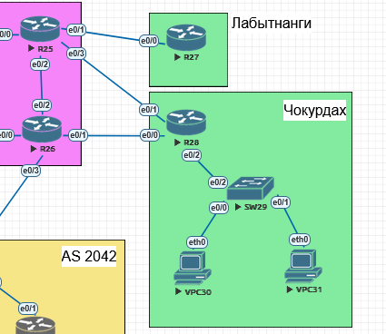

# Политика маршрутизации офиса Чокурдах (PBR + IP SLA)
##  Задание:

Распределить пользовательский трафик офиса Чокурдах между двумя провайдерскими линками с автоматическим переключением при отказе основного канала. Настроить маршрут по умолчанию для офиса Лабытнанги.
  

## Топология:
- **AS 520**: Триадa
- **Чокурдах**
- **Лабытнанги**
  

## Адресация: Устройств Используемых в данном Примере

#### 1. Таблица адресации сетевых устройств "Чокурдах":
| Устройство    | Интерфейс    | IP-адресс          |
|--------------:|:-------------|-------------------:|
| R28           | loopback     | 10.21.37.12/32     | 
| R28           | e0/2.37      | 10.37.21.12/25      | 
| R28           | e0/1.21      | 10.21.73.12/25     | 
| R28           | e0/0.23      | 10.21.7.12/25      | 
| R28           | e0/2.13      | 10.2.4.1/25        | 
| SW29          | Vlan 37      | 10.37.21.8/25      | 
| VPC30         | Vlan 13      | 10.2.4.2/25        | 
| VPC31         | Vlan 13      | 10.2.4.3/25        | 

#### 2. Таблица адресации сетевых устройств "Триада (AS 520)":
| Устройство    | Интерфейс    | IP-адресс          |
|--------------:|:-------------|-------------------:|
| R25           | loopback     | 10.21.37.15/32     |  
| R25           | e0/0.22      | 10.21.3.15/25      |  
| R25           | e0/1.23      | 10.21.7.15/25      | 
| R25           | e0/2.24      | 10.21.10.15/25     | 
| R25           | e0/3.21      | 10.21.73.15/25     | 
| R26           | loopback     | 10.21.37.16/32     | 
| R26           | e0/0.22      | 10.21.3.16/25      | 
| R26           | e0/1.23      | 10.21.7.16/25      | 
| R26           | e0/2.24      | 10.21.10.16/25     | 
| R26           | e0/3.21      | 10.21.73.16/25     | 

#### 3. Таблица адресации сетевых устройств "Лабытнанги":
| Устройство    | Интерфейс    | IP-адресс          |
|--------------:|:-------------|-------------------:|
| R27           | loopback     | 10.21.37.17/32     | 
| R25           | e0/0.23      | 10.21.7.17/25      | 

##  Конфигурации:  
  ###  [R28 Чокурдах][def]  
    
    IP SLA и Track  
  
      ip sla 1  
      icmp-echo 10.21.73.15 source-interface Ethernet0/1.21  
      threshold 1000  
      timeout 1000  
      frequency 5  
      ip sla schedule 1 life forever start-time now  
  
      ip sla 2  
      icmp-echo 10.21.7.16 source-interface Ethernet0/0.23  
      threshold 1000  
      timeout 1000  
      frequency 5  
      ip sla schedule 2 life forever start-time now  
  
      track 1 ip sla 1 reachability  
      track 2 ip sla 2 reachability  
  
    Policy-Based Routing  

      ip access-list standard USER_CHU  
      permit 10.2.4.0 0.0.0.127  
  
      route-map CHU permit 10  
      match ip address USER_CHU  
      match track  1  
      set ip next-hop 10.21.73.15  
  
      route-map CHU permit 20  
      match ip address USER_CHU  
      set ip next-hop 10.21.7.16  
  
      route-map CHU permit 30  
      description "main other"  
  
      interface Ethernet0/2.13  
      ip policy route-map CHU  
  

  ###  [R27 Лабытнанги][def1]  
    
    default route   

      ip route 0.0.0.0 0.0.0.0 10.21.37.15  
  
## Проверка и тестирование:  
  ### Состояние Track и IP SLA  
        
      R28#show track  
      Track 1  
      IP SLA 1 reachability  
      Reachability is Up  
      2 changes, last change 00:56:15  
      Latest operation return code: OK  
      Latest RTT (millisecs) 1  
      Tracked by:  
      Route Map 0  
      Track 2  
      IP SLA 2 reachability  
      Reachability is Up  
      2 changes, last change 00:56:15  
      Latest operation return code: OK  
      Latest RTT (millisecs) 1  
  
  
      R28# show ip sla statistics  
      IPSLA operation id: 1  
      Latest RTT: 1 milliseconds  
      Latest operation return code: OK  
      Number of successes: 343  
      Number of failures: 0  
  
      IPSLA operation id: 2  
      Latest RTT: 1 milliseconds  
      Latest operation return code: OK  
      Number of successes: 39  
      Number of failures: 0  
  
  ###  Применение политики к интерфейсу:   

      R28# show ip policy  
      Interface          Route map  
      Ethernet0/2.13     CHU  

  

[def]: conf/base_conf.md 
[def1]: conf/base_conf2.md  

